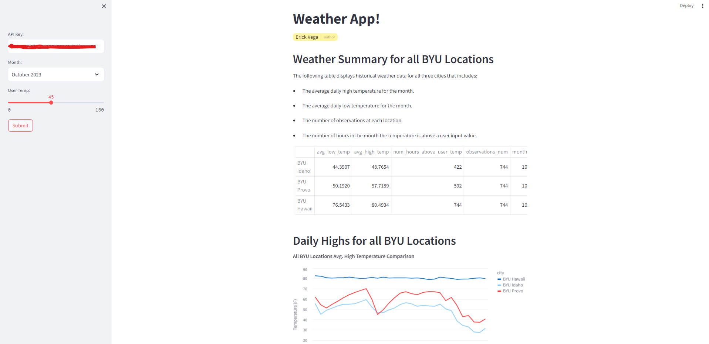

---
format:
    html:
      embed-resources: true
editor: visual
---

# Challenge General Information

## Streamlit App

1. Open the repo: https://github.com/erickveg/app_challenge_wi24
2. Clone the repo
3. Run `docker compose up` in your terminal
4. Enjoy!

## Value of DataBricks

DataBricks provided the computing power needed to perform calculations with big data which wasn't available on my local computer. DataBricks made it easier to collaborate and share Data Science project since is a cloud-based platform. Using DataBrick was pretty convenient since all the basic Python libraries were are installed. The feature that I loved the most about DataBricks was the ability to create simple databases with multiple tables and they were accessible for everyone from any project!

## PySpark vs Pandas

PySpark is a library for data analysis designed to procces big data incredibly fast, while Pandas works great but most of the times with small datasets. PySpark has pretty convenient functions that avoid bulky code, a good example of that is the `window` function which can slice, group by, and aggregate in a couple of lines of code while Pandas sometimes performs one action at the time, duplicating the work done by the computer. One of the main disadvantages of PySpark is that most plotting libraries don't support PySpark dataframes, so they have to be converted to Pandas dataframes first.

Pandas, in the other hand, is easier to read and faster to learn for beginners. It makes actions like filter, rename, and apply custom functions way easier than PySpark because of it's friendlier syntax.

## What is Docker
Docker is a platform that helps programmers share a piece of software (an application) gathering all the external pieces (requirements) that makes the application work and puts into a single package which is call a container. This containers can be shared or uploaded to a provider that can make the application available throught the internet.